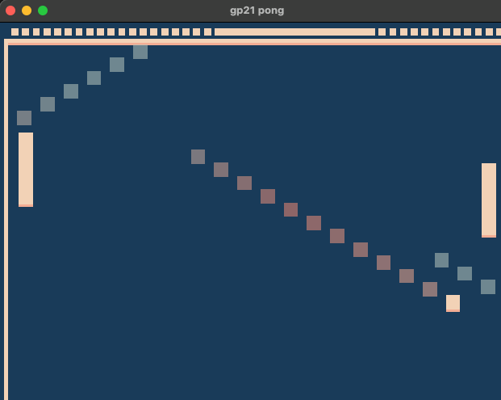

Crazy Portal

Author: Liang Yen Chou

Design: Player plays pong game in the space with random portals which teleport balls to anywhere!

Screen Shot:

How To Play:

Similar normal ping pong game. However, the court is very unstable. Players have to beware of when the ball hit on the boundery, becuase the crash on the court might generate portals in the space which randomly teleport ball to somewhere. It's hard to predict the ball, try to catch it up!

Sources: (TODO: list a source URL for any assets you did not create yourself. Make sure you have a license for the asset.)

This game was built with [NEST](NEST.md).
